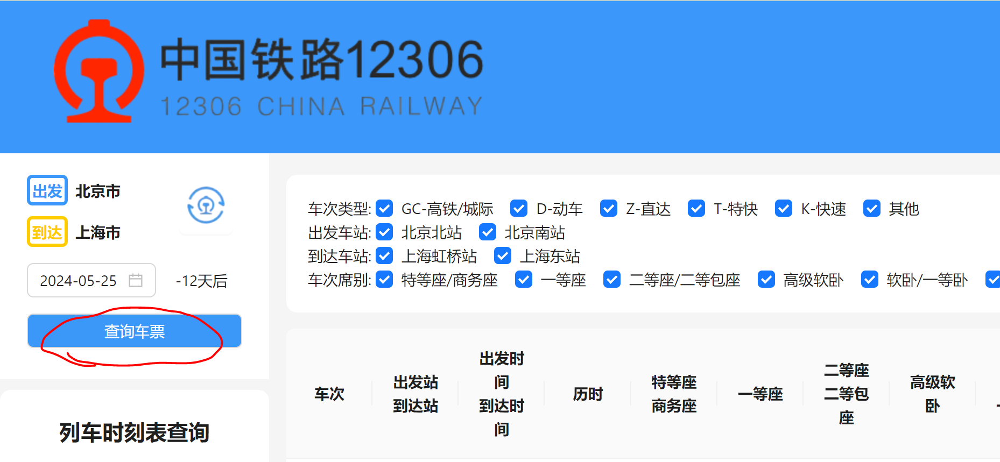
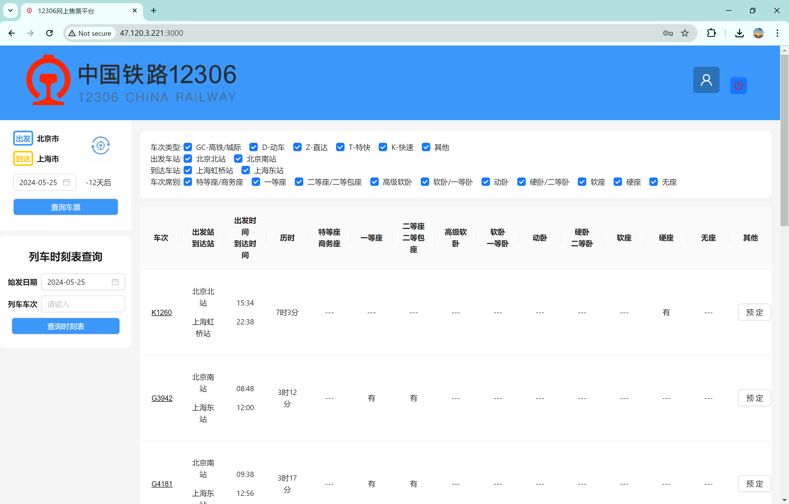
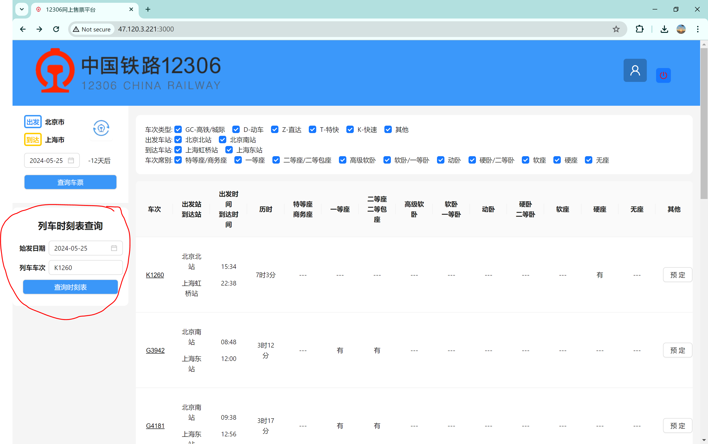

# CS3321-Database-Project

## 在线服务
当前支持在线服务, 服务地址为 [http://47.120.3.221:3000/](http://47.120.3.221:3000/)
我们强烈推荐您尝试在线服务, 以便更好地了解我们的项目。
请选取日期为2024-05-25以获取可用数据。

## 项目演示

### 用户注册和用户登录演示

### 用户根据上车站和下车站和时间查询可以乘坐的车次
用户可以在左上方选择出发城市和到达城市, 以及选择日期, 然后点击**查询车票**按钮, 即可查询到相应日期从出发城市到到达城市的车次信息。
此外每个车次还能显示相应的余票信息.

车次信息包括车次号, 出发站, 到达站, 出发时间, 到达时间, 席位类型(特等座, 一等座, 二等座, 无座), 价格。

### 用户购票 和用户查询已购买车票演示

1. 用户从查询结果中选择有余票的车次, 然后点击查询页面中表格右侧对应车次的**预定**按钮
2. (已登录)用户可以进入购票页面, 未登录用户需要先登录
3. 用户进行购票页面后, 选择相应的乘车人, 然后提交订单, 即可发起购票
4. 购票成功后, 会返回购票成功信息提醒, 同时可以在个人页面查看相应的购票信息

### 用户退票演示

用户进入个人页面, 找到相应的订单, 点击**退票**按钮, 即可发起退票.

退票成功后, 会返回退票成功信息提醒, 同时可以在个人页面看到原有订单已经被删除.

### 用户查询列车时刻表演示

用户可以根据车次号和始发时间查询列车时刻表, 用户也可以根据列车唯一标识码查询列车时刻表.

### 用户查询城市-火车站列表

用户可以在网站左上方选择相应的城市和城市的火车站.

