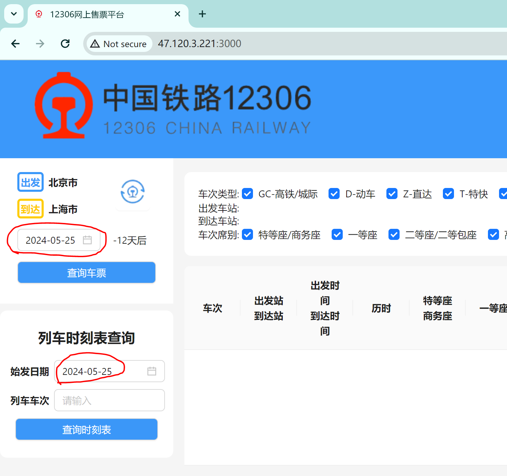
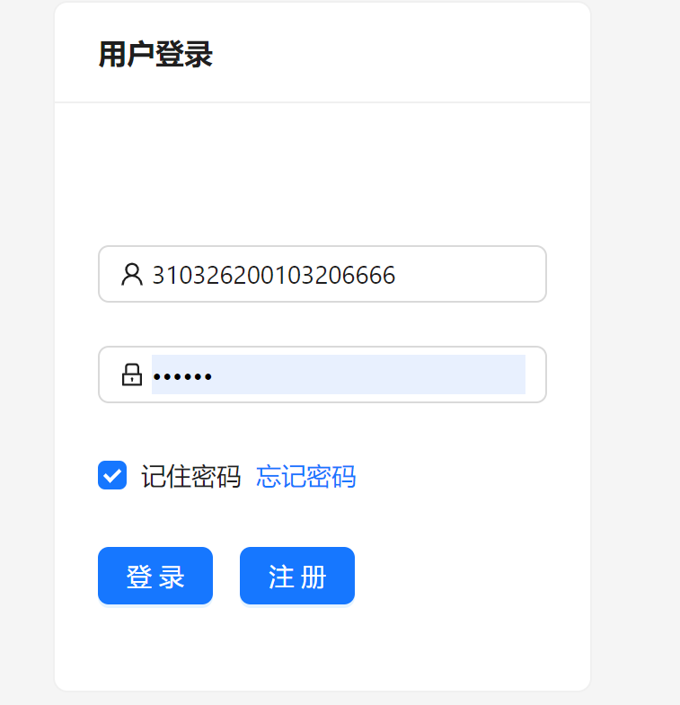
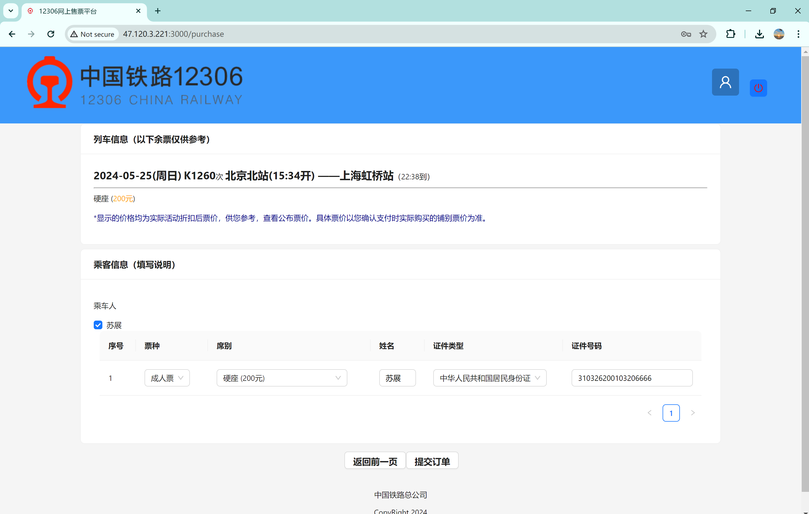
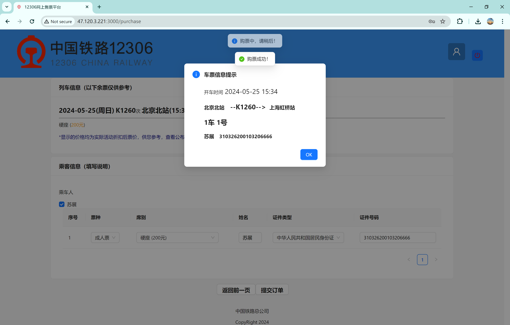

# CS3321-Database-Project

## 在线服务
当前支持在线服务, 服务地址为 [http://47.120.3.221:3000/](http://47.120.3.221:3000/)
我们强烈推荐您尝试在线服务, 以便更好地了解我们的项目。
请选取日期为2024-05-25以获取可用数据。

## 项目演示

### 1. 用户注册和登录

点击右上角【头像】标志，进入【个人中心】，会自动跳转到登陆页面

新用户请先注册

### 2. 用户查询车票

用户可以在网站左上方选择相应的城市和城市的火车站.

用户还可以选择日期, 然后点击**查询车票**按钮, 即可查询到相应日期从出发城市到到达城市的车次信息。

车次信息包括车次号, 出发站, 到达站, 出发时间, 到达时间, 席位类型(特等座, 一等座, 二等座, 无座等), 价格。

可依据车次类型、出发车站、到达车站、车次席别对查询结果进行筛选

点击带有下划线的车次号，可以查看列车时刻表

### 3. 用户购票

1. 用户从查询结果中选择有余票的车次, 然后点击查询页面中表格右侧对应车次的**预定**按钮
2. (已登录)用户可以进入购票页面, 未登录用户将被重定向到登陆页
3. 用户进行购票页面后, 选择相应的乘车人, 然后提交订单, 即可发起购票

### 4. 个人中心

购票成功后, 会返回购票成功信息提醒, 同时可以在【个人中心】查看相应的购票信息

点击【行程信息提示】，生成电子客票

点击车次号，查看列车时刻表

### 5. 用户退票

用户进入【个人中心】, 找到相应的订单, 点击**退票**按钮, 即可发起退票.
退票成功后, 会返回退票成功信息提醒, 同时可以在个人页面看到原有订单已经被删除.

### 6. 列车时刻表查询

用户可以根据车次号和始发日期查询列车时刻表

完成操作后，点击右上角红色关机按钮即可退出登陆
