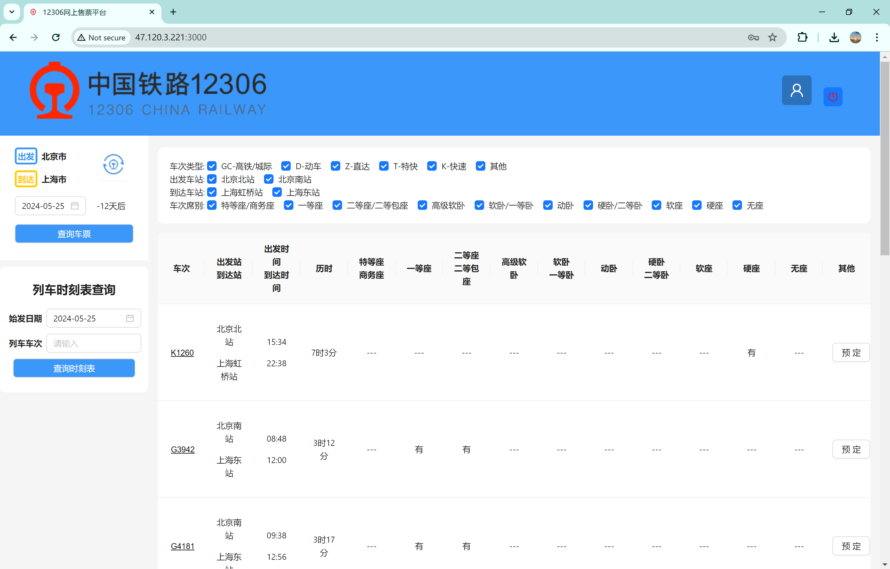

# CS3321-Database-Project

## Online Service
Currently, we support an online service, and the service address is [http://47.120.3.221:3000/](http://47.120.3.221:3000/)
We strongly recommend that you try the online service to better understand our project.
Please select the date as 2024-05-25 to obtain available data.

## Project Demo

### User Registration and Login Demo

### User Query Trains by Departure Station, Arrival Station, and Time
Users can select the departure city and arrival city in the upper left corner, as well as choose the date. Then click the **查询车票** button to query the train information from the departure city to the arrival city on the selected date.
In addition, each train can display the corresponding ticket availability information.

The train information includes train number, departure station, arrival station, departure time, arrival time, seat type (special seat, first class seat, second class seat, no seat), and price.

### User Purchase Tickets and Query Purchased Tickets Demo

1. Users select a train with available tickets from the query results, and then click the **预定** button on the right side of the table on the query page.
2. (Logged in) Users can enter the ticket purchase page, while non-logged in users need to log in first.
3. After entering the ticket purchase page, users can select the corresponding passenger and then submit the order to initiate the ticket purchase.
4. After a successful ticket purchase, a message will be displayed to indicate the successful purchase, and the corresponding ticket information can also be viewed on the personal page.

### User Ticket Refund Demo

Users can go to the personal page, find the corresponding order, and click the **退票** button to initiate a ticket refund.

After a successful refund, a message will be displayed to indicate the successful refund, and the original order will be deleted from the personal page.

### User Query Train Timetable Demo

Users can query the train timetable based on the train number and departure time, or based on the unique identifier of the train.

### User Query City-Train Station List

Users can select the corresponding city and train station of the city in the upper left corner of the website.

