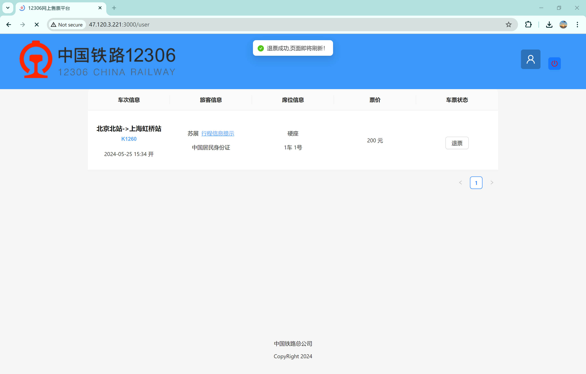

# CS3321-Database-Project

## Online Service
Currently, we support online services, and the service address is [http://47.120.3.221:3000/](http://47.120.3.221:3000/)
We strongly recommend that you try the online service to better understand our project.
Please select the date as 2024-05-25 to obtain available data.

## Project Demo

### 1. User Registration and Login

Click the **Avatar** icon in the upper right corner to enter the **Personal Center**, and you will be automatically redirected to the login page.

New users please register first.

### 2. User Ticket Query

Users can select the corresponding city and city train station in the upper left corner of the website.

Users can also select a date and then click the **查询车票(Query Tickets)** button to query the train information from the departure city to the destination city on the corresponding date.

The train information includes the train number, departure station, arrival station, departure time, arrival time, seat type (special seat, first-class seat, second-class seat, no seat, etc.), and price.

You can filter the query results based on train type, departure station, arrival station, and seat type.

Click on the underlined train number to view the train timetable.

### 3. User Ticket Purchase

1. Users select a train with available tickets from the query results, and then click the **预定(Book)** button on the right side of the table on the query page.
2. (Logged in) Users can enter the ticket purchase page, and non-logged in users will be redirected to the login page.
3. After entering the ticket purchase page, users can select the corresponding passengers and then submit the order to initiate the ticket purchase.

### 4. Personal Center

After a successful ticket purchase, you will receive a reminder of the successful ticket purchase and you can also view the corresponding ticket purchase information in the **Personal Center**.

Click on **Trip Information Reminder** to generate an electronic ticket.

Click on the train number to view the train timetable.

### 5. User Ticket Refund

Users can enter the **Personal Center**, find the corresponding order, and click the **退票(Refund)** button to initiate a ticket refund.
After a successful refund, you will receive a reminder of the successful refund, and you can also see that the original order has been deleted on the personal page.

### 6. Train Timetable Query

Users can query the train timetable based on the train number and the departure date.

After completing the operation, click the red power button in the upper right corner to log out.

